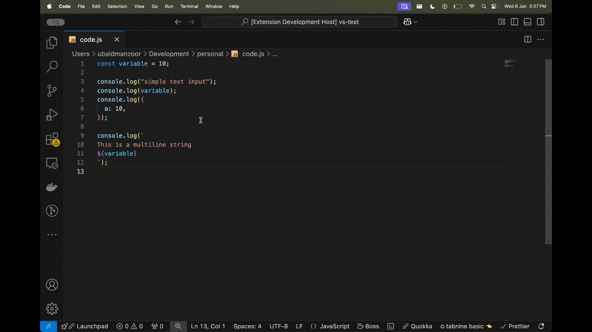
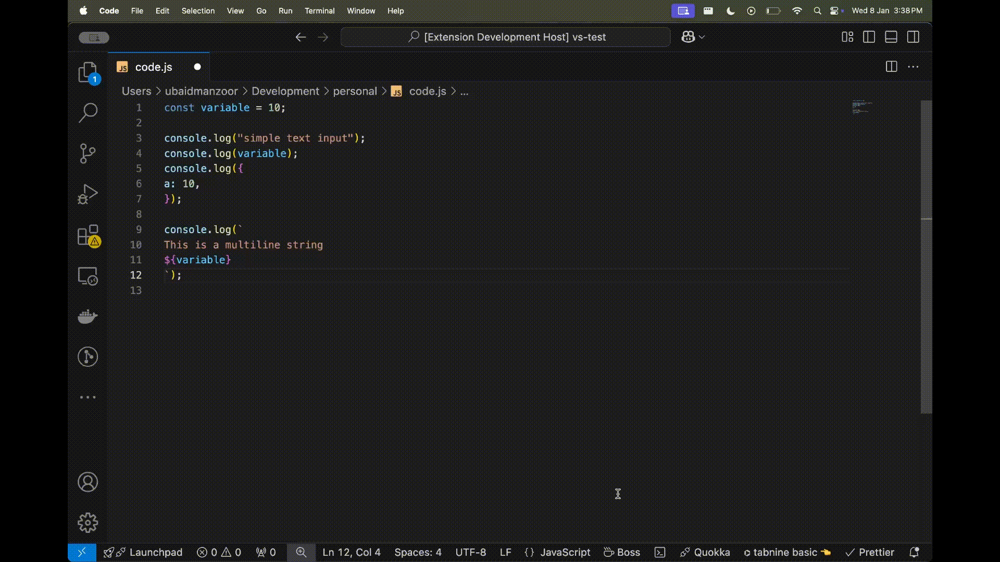

# LogBoss

LogBoss is a VS Code extension that helps you manage console.log statements effortlessly. Quickly highlight, comment, or remove logs in your current file keeping your code clean and production-ready. 🚀

## Features

### 1. Toggle Console Highlights

Command: `LogBoss: Toggle Console Highlights`

- Highlights all console statements in the current file
- Auto-removes highlighting when switching files
- Supports all console methods (log, warn, error, info, debug, trace)
- Detects both active and commented console statements
- Handles multi-line console statements

### 2. Toggle Console Comments

Command: `LogBoss: Toggle Console Comments`

- Comment/uncomment console statements with a single command
- Smart indentation preservation
- Handles multi-line console statements
- Preserves code formatting

### 3. Remove Console Statements

Command: `LogBoss: Remove Console Statements`

- Removes all console statements from the current file
- Handles both active and commented console statements
- Works with single-line and multi-line statements
- Preserves code formatting and structure

## Usage

1. Open a JavaScript/TypeScript file
2. Access commands through:
   - Command Palette (`Ctrl+Shift+P` or `Cmd+Shift+P`)
   - Status bar icon (`☕ Boss`)
   - Keyboard shortcut (`Ctrl+Shift+Space` or `Cmd+Shift+Space`)
   - Right-click context menu

## Coming Soon 🚀

### 1. Full Directory Support

- Process console statements across entire directories
- Selective file filtering (e.g., ignore node_modules)
- Support for workspace-wide changes

### 2. Enhanced Console Management

- Group related console statements
- Temporary console statement timeouts
- Custom highlighting colors
- Console statement statistics

## Tips

- Use the highlight feature to review all console statements before removing them
- The extension preserves code formatting when removing or commenting statements
- Works with both JavaScript and TypeScript files
- Toggle comments feature shows whether it will add or remove comments
